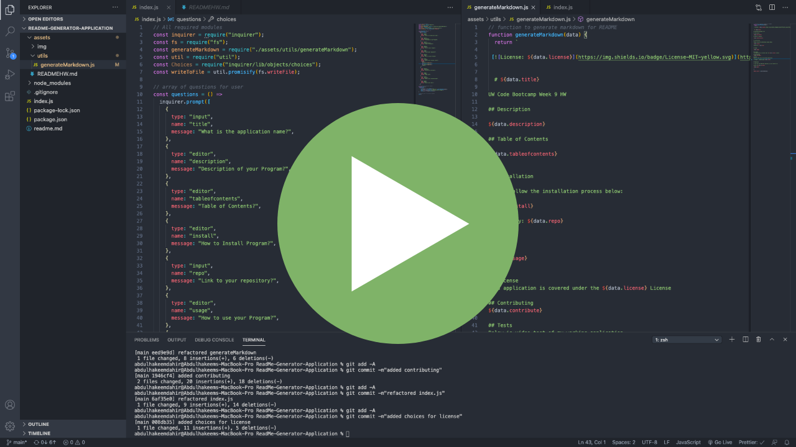

[](https://opensource.org/licenses/MIT)

# Readme Application Generator

UW Code Bootcamp Week 9 HW

## Description

Hello everyone, and welcome back to my Repo! My name is Abdulhakeem Dahir and I am an aspiring Software Developer. This week I have been tasked to make a README generator application. This application will automatically format your readme for you. All that you have to provide is the information asked in the the terminal. We used inquirer npm for this project. Hope you like, any feedback is welcome.

## Table of Contents

- [Description](#description)
- [Installation](#installation)
- [Usage](#usage)
- [License](#license)
- [Tests](#tests)
- [Questions](#questions)

## Installation

Please follow the installation process below:

```
1. Fork the repository from the link below
2. Clone the repo to your computer via git
3. Open the project files with the text editor of your choice.
4. Install npm dependencies: Inquirer

```

Respository:
https://github.com/abdulhakeemdahir/ReadMe-Generator-Application

## Usage

To use the application, you have to install the Inquirer NPM package. Then you run the application by running node index.js in your integrated terminal. Follow the questions prompts and input the correct information. Once you’ve completed the prompts, you will get a notification in the console that shows your readme has been generated. Enjoy your automatically formatted readme.

## License

This application is covered under the MIT License

## Contributing

If you would like to contribute, please contact me and I will add you as a contributor. My contact information is below.

## Tests

Below is video test of my working application

[](https://drive.google.com/file/d/1wSULFI8VnGl55tQ5PYSF-kfOIru3KO5K/view?usp=sharing)

## Questions

If you have any additional questions, you can reach me at:

Github Profile: www.github.com/abdulhakeemdahir

E-mail: somlutions@gmail.com
